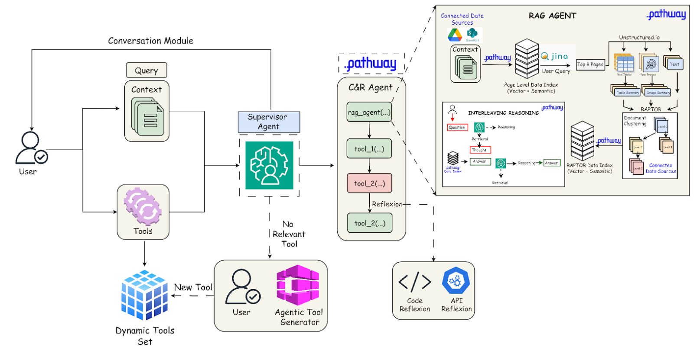
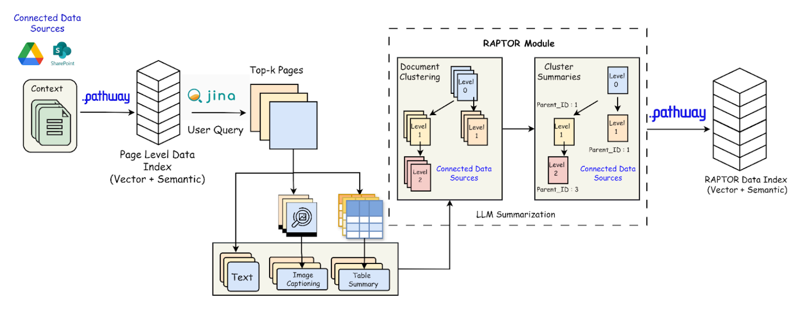
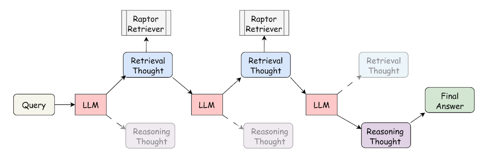
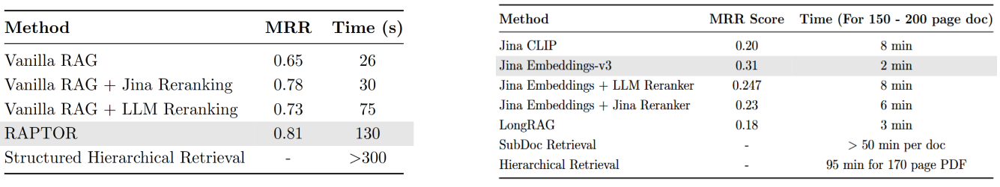
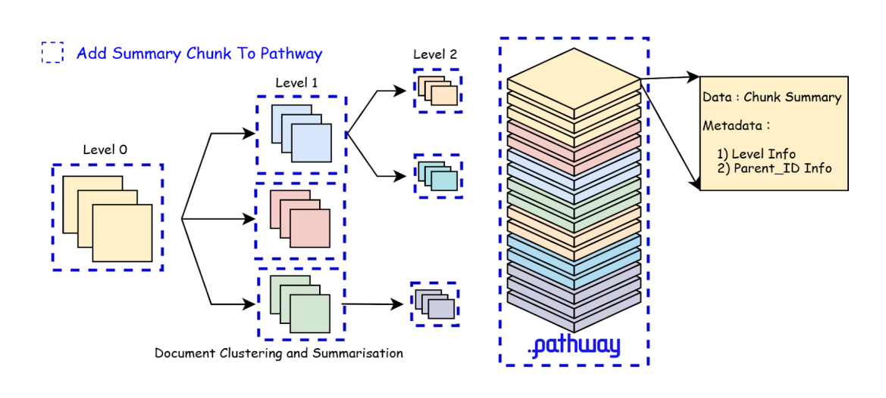
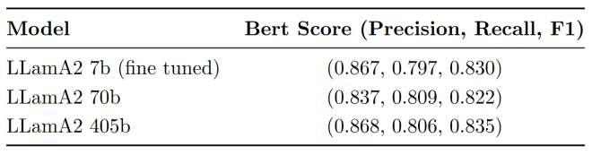
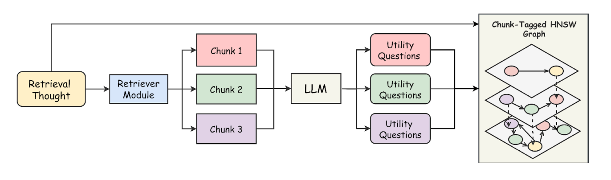
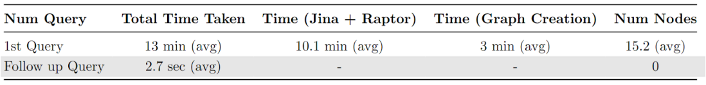

## Introduction

In the ever-evolving landscape of artificial intelligence, the intersection of AI and enterprise applications has seen significant advancements. However, deploying AI systems that are not only intelligent but also adaptive remains a challenge, especially in sectors like finance and law where precision and up-to-date insights are paramount. Traditional generative AI models often fall short in these environments due to their static nature, outdated knowledge, and lack of real-time decision-making capabilities.

Here is where Retrieval-Augmented Generation (RAG) systems come into play. These systems have emerged as a promising solution, but they too have their limitations. In this blog, we’ll explore how we’ve developed a **Dynamic Agentic RAG System** specifically designed for long, intricate legal and financial documents. This system not only addresses the shortcomings of traditional RAG systems but also introduces novel approaches to retrieval, reasoning, and memory management.

## Why RAG? The Need for Dynamic Retrieval and Reasoning

### The Limitations of Traditional AI Models

Imagine asking ChatGPT about a niche financial law that was recently passed. The model wouldn’t know about it because it was trained before the law existed. This is where RAG comes into play. Instead of relying solely on pre-trained data, RAG systems retrieve relevant information from external databases or documents and use Large Language Models (LLMs) to generate contextually accurate responses.

### Why RAG is Essential

1. **AI Models Can’t Store Everything**: The sheer volume of data in legal and financial domains makes it impossible for AI models to store all relevant information in their memory.
2. **Constant Data Creation**: New data is continuously being generated, and RAG ensures that the AI can access the most up-to-date information.
3. **Factual and Grounded Responses**: By retrieving information from external sources, RAG systems provide responses that are more factual and grounded in reality.

### The Problem with Traditional RAG Systems

Traditional RAG systems often retrieve information indiscriminately, failing to adapt dynamically based on query complexity. This inefficiency is particularly problematic in financial and legal contexts, where data relevancy is critical. Moreover, these systems treat retrieval and reasoning as separate entities, first performing context retrieval and then providing the context as a prompt to the LLM for reasoning. This approach falls short when dealing with complex multi-hop queries that require interleaved retrieval and reasoning.

## Introducing the Dynamic Agentic RAG System

### A Multi-Agent Approach

To address these challenges, we adopted a **multi-agent approach**. In this system, different AI agents specialize in distinct tasks, working together to achieve a common goal. This approach introduces specialization, allowing each agent to focus on a specific aspect of the retrieval and reasoning process.

#### What Are Agents?

Agents are autonomous systems that analyze and act based on their environment to achieve specific goals. They can retrieve, process, and synthesize information, making decisions dynamically rather than following rigid rules. In our system, we have multiple agents, each specializing in tasks like retrieval, reasoning, and tool handling.

### The Role of Tools

In addition to retrieval and reasoning, our system incorporates **tools**—modular add-ons that enhance the system’s capabilities. Tools can include calculators, web search modules, chart generators, and more. These tools not only increase the accuracy of responses but also reduce human intervention, allowing the AI to surpass its inherent limitations.

### Pathway: The Backbone of Our System

For such an intelligent system to operate at scale, it requires an underlying infrastructure capable of handling massive data flows and real-time computations. **Pathway** serves as the backbone of our system, offering:

- **High-speed data processing** to ensure minimal latency.
- **Real-time retrieval** for dynamic knowledge updates.
- **Multi-modal data handling** to process various types of data.
- **Simplified deployment** with Docker and Kubernetes.

With Pathway, our Dynamic RAG system can operate seamlessly across vast datasets, continuously learning and adapting to new information without compromising speed or accuracy.

## System Architecture and Workflow

### Overview of the Workflow

The workflow of our Dynamic Agentic RAG System begins with the user providing a query (Q), a set of documents (D), and a set of tools (T). The system then follows these steps:

1. **Supervisor Agent Activation**: The Supervisor Agent activates the Code & Reasoning (C&R) Agent, which can interact with tools and the RAG Agent.
2. **Document Indexing**: The RAG Agent builds a document index for D using Pathway’s VectorStore Server.
3. **Page-Level Retrieval**: The system uses Jina Embeddings to perform page-level retrieval, extracting the top-k most relevant pages for Q.
4. **Hierarchical Indexing**: The retrieved pages are chunked and indexed using RAPTOR, forming a hierarchical structure over the summary of the chunks.
5. **Interleaved Retrieval and Reasoning**: The RAG Agent uses an interleaving approach to iterate between reasoning and retrieval, performing multi-hop contextual reasoning.
6. **Tool-Specific Tasks**: The C&R Agent utilizes tools for any tool-specific tasks based on the RAG Agent’s response and user query.
7. **Response Consolidation**: The Supervisor Agent consolidates the outputs and returns the final response to the user.

### Two-Stage Retrieval Pipeline

Retrieving information from large documents, such as financial and legal reports, is challenging due to their inherent hierarchies and diverse entities like tables, charts, and images. To address this, we designed a custom **two-stage retrieval pipeline**:

#### 1. Page-Level Retrieval using Jina Embeddings

We use **Jina Embeddings-v3**, which is specifically trained for embedding generation in long-context document retrieval. Given an initial query Q and a long document D with N pages, we generate query embeddings and page-level embeddings using each page’s text content. We then construct a FAISS index and retrieve the top-k pages relevant to the query.

- **Integration with Pathway**: Pathway’s VectorStoreServer indexes documents by storing page-level content. For a long document D with N pages, a JSONL file is created, where each entry contains page text and its corresponding page number as metadata. The top-k pages are retrieved based on the embedding similarity between the query and page text.

#### 2. Page-Level Preprocessing using Unstructured

Documents often contain tables and images that hold critical information. To capture this data, we use the **Unstructured library** to parse the retrieved pages into images, plain text, and tables, each with associated metadata (page number). The extracted data is then summarized by an LLM, recombined page-wise, and indexed.

#### 3. RAPTOR Index for Context Retrieval

**RAPTOR** (Recursive Abstractive Processing for Tree-Organized Retrieval) is a bottom-up indexing approach that segments the document into text chunks, embeds them, clusters the embeddings, and summarizes each cluster with an LLM, forming a hierarchical tree structure. This approach greatly reduces indexing time and enables structured retrieval at multiple levels.

- **Integration of RAPTOR with Pathway**: We integrated the entire RAPTOR pipeline using Pathway’s VectorStore. Given page-wise content, we apply the RAPTOR Clustering algorithm to form a hierarchical tree. A JSONL file is created where the "cluster summary" is the primary data field, and metadata includes "level" and "parent_id" for hierarchical information.

## Interleaved Retrieval and Reasoning: A Novel Approach

### The Need for Interleaving

Now, retrieval alone isn’t enough for complex legal and financial queries. Why?

Basic RAG lacks **deduction and synthesis capabilities**—essential for handling multi-hop reasoning over long documents. Several reasoning paradigms have attempted to bridge this gap:

- **Chain of Thought (CoT)**: Encourages step-by-step reasoning, breaking problems into intermediate logical steps. However, CoT follows a linear path, making it inefficient for multi-hop queries that require branching logic.
- **Tree of Thought (ToT)**: Extends CoT by exploring multiple reasoning paths, akin to a decision tree. While more flexible, ToT introduces redundancy by retrieving unnecessary information and increases token usage, especially when a reasoning path leads to a dead end.

#### Experimenting with Graph-Based Reasoning

We also explored **graph-based reasoning** with **ROG (Reasoning on Graphs)**. While effective when working with structured knowledge graphs (KGs), it struggled with sparsity issues. Many LLM-driven KG generation techniques fail to capture implicit logical dependencies in financial and legal documents, limiting their reliability.

#### Interleaving RAG Reasoning

Traditional RAG systems separate retrieval and reasoning into distinct steps, leading to inefficiencies in complex multi-hop queries. Our system introduces a novel **interleaving RAG reasoning approach**, allowing LLMs to dynamically decide when to retrieve and when to reason. By integrating retrieval within the reasoning process, our approach eliminates redundant lookups, efficiently resolving multi-hop contextual queries.

### How Interleaving Works

1. **Query Input**: The process starts with a user query.
2. **LLM Generates a Thought**: The LLM produces an initial reasoning step.
3. **Retrieval Step**: The model retrieves relevant documents from an index based on the reasoning step.
4. **LLM Refines the Thought**: The retrieved information is processed, and the LLM generates further reasoning.
5. **Interleaving Process**: This cycle of retrieval and reasoning continues iteratively, refining the knowledge step by step.
6. **Final Answer**: After sufficient iterations, the LLM produces a final, well-informed answer.

### Why Interleaving is Useful

- **Dynamic Refinement**: It allows the model to dynamically refine its reasoning based on retrieved information.
- **Reduced Hallucination**: By grounding responses in real-time knowledge retrieval, interleaving reduces the likelihood of the model generating incorrect or hallucinated responses.
- **Improved Performance**: Interleaving significantly improves performance in multi-step reasoning tasks, especially for complex queries.

## Benchmarking and Results

To validate our approach, we benchmarked different retrieval techniques:

- **Vanilla RAG and its variants** performed poorly in both Mean Reciprocal Rank (MRR) and time.
- **RAPTOR + Jina Embeddings** drastically outperformed traditional chunking, delivering high-precision retrieval without compromising speed.

We also experimented with various reasoning methods:

- **Knowledge Graphs (KGs)**: While effective when fully structured, KGs struggle with sparse data scenarios.
- **Interleaving RAG**: This approach bridges the gap by dynamically balancing retrieval and reasoning, outperforming traditional methods like Chain of Thought (CoT) and Tree of Thought (ToT).

!interleaving_results

## Fine-Tuning LLMs for Domain-Specific Tasks

While large models like LLaMA 2-70B or 405B are powerful, they are often resource-intensive. We fine-tuned **LLaMA-7B** using **Parameter Efficient Fine-Tuning (PEFT)** with **LoRA adapters** on an Nvidia A100. The target task was generating high-quality summaries for the CUAD dataset (Contract Understanding Dataset). Our locally loadable summarizer performed on par with larger models and even outperformed them in some cases.

## Scaling Retrieval Efficiency with HNSW

### Dynamic Memory Cache Module

To enhance retrieval efficiency in long-document RAG, we built a **Dynamic Memory Cache Module** using **HNSW (Hierarchical Navigable Small World)** for fast approximate nearest neighbor search.

For each retrieval query, we extract the top-k most relevant chunks and generate utility queries based on their content. These queries are cross-referenced with the existing query bank to eliminate redundancy. We then construct a dynamic memory cache using **nmslib**, building an HNSW graph over the utility queries.

This enables efficient retrieval by checking the query bank for similar queries and directly accessing relevant chunks if a match is found. HNSW’s multi-layered graph structure supports real-time updates, making it well-suited for dynamic RAG.

### Why HNSW?

- **Efficiency in High Dimensions**: Unlike tree-based methods that suffer in high dimensions, HNSW maintains efficiency.
- **Real-Time Indexing**: HNSW supports real-time creation and modification of graph indexes, ideal for dynamic systems.
- **Memory Efficiency**: It avoids brute-force comparisons and stores embeddings in a compressed form, reducing storage overhead.

### How We Use HNSW in Dynamic Memory

- **Metadata Tagging**: QA pairs, related queries, and retrieved chunks enrich the knowledge base.
- **User-Adaptive Learning**: The system adapts to query history over time.
- **Lightning-Fast Follow-Ups**: Stored query embeddings speed up contextualized retrieval.

By combining HNSW with interleaving RAG, we achieve ultra-fast, context-aware retrieval in follow-up queries, pushing long-document retrieval into the future.

## Conclusion

Thanks for reading! Feel free to contribute.
